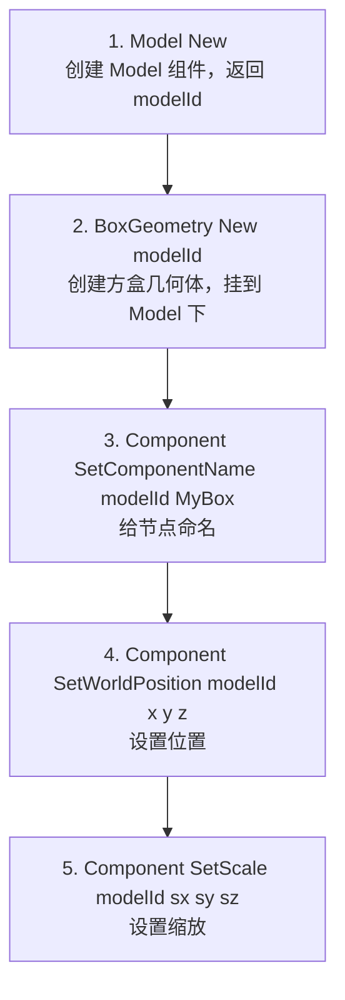

## 一、如何知道引擎支持哪些命令

### 方法 1：发送 `Help` 命令

引擎内置了 `Help` 命令，会打印所有已注册的命令名及说明：

```python
rpc_request = {
    "jsonrpc": "2.0",
    "id": 1,
    "method": "CommonCommand",
    "params": ["help"]
}
```

从 `EngineCommandManager::Run()` 源码可以看到：

```107:108:Render/GWEngine/source/private/features/engineCommand/EngineCommandManager.cpp
	if (cmd == "Help" || cmd == "help")
		return Help();
```

`Help()` 会调用 `EngineCommandFactory::GetCommandsHelp()`，遍历所有注册的命令名。

### 方法 2：直接看源码注册表

所有顶级命令都在 `EngineCommandFactory.cpp:51-95` 中注册，共 **33 个顶级命令**：

| 命令名 | 说明 | 对应的 C++ 类 |
|---|---|---|
| `Component` | 组件通用操作（位置/旋转/缩放/父子关系等） | `ComponentCmd` |
| `Scene` | 场景操作 | `SceneCmd` |
| `Camera` | 相机操作 | `CameraCmd` |
| `Model` | 模型操作 | `ModelCmd` |
| `Light` | 灯光操作 | `LightCmd` |
| `EmptyNode` | 空节点 | `EmptyNodeCmd` |
| `BoxGeometry` | 方盒几何体 | `BoxGeometryCmd` |
| `SphereGeometry` | 球体几何体 | `SphereGeometryCmd` |
| `CylinderGeometry` | 圆柱几何体 | `CylinderGeometryCmd` |
| `PlaneGeometry` | 平面几何体 | `PlaneGeometryCmd` |
| `ConeGeometry` | 圆锥几何体 | `ConeGeometryCmd` |
| `CapsuleGeometry` | 胶囊几何体 | `CapsuleGeometryCmd` |
| `TorusGeometry` | 圆环几何体 | `TorusGeometryCmd` |
| `PyramidGeometry` | 棱锥几何体 | `PyramidGeometryCmd` |
| `IcosphereGeometry` | 二十面体球 | `IcosphereGeometryCmd` |
| `TorusKnotGeometry` | 环面纽结 | `TorusKnotGeometryCmd` |
| `ParticleSystem` | 粒子系统 | `ParticleSystemCmd` |
| `Prefab` | 预制体 | `PrefabCmd` |
| `Skybox` | 天空盒 | `SkyboxCmd` |
| `Decal` | 贴花 | `DecalCmd` |
| `Text3D` | 3D 文字 | `Text3DCmd` |
| `Audio` | 音频 | `AudioComponentCmd` |
| `VideoPlayer` | 视频播放器 | `VideoPlayerCmd` |
| `VolumeLight` | 体积光 | `VolumeLightCmd` |
| `ReflectionProbe` | 反射探针 | `ReflectionProbeCmd` |
| `Timeline` | 时间线 | `TimelineCmd` |
| `GameUI` | 游戏 UI | `GameUICmd` |
| `Select` | 选择操作 | `SelectCmd` |
| `Interaction` | 交互操作 | `InteractionCmd` |
| `Layer` | 图层 | `LayerCmd` |
| `RenderableComponent` | 可渲染组件 | `RenderableCmd` |
| `Debug` | 调试 | `DebugCmd` |
| `PhysicsActor` | 物理体 | `PhysicsActorCmd` |
| `CharacterController` | 角色控制器 | `CharacterControllerCmd` |

### 方法 3：每个命令的子操作

每个顶级命令有一组子操作（sub-command），定义在各 `*Cmd.h` 头文件的宏中。比如 `Component` 命令的子操作定义在 `ComponentCmd.h:29-135`：

```
Component List               — 列出所有组件ID
Component New                — 新建组件（一般不用，用具体类型代替）
Component QueryIdWithName    — 按名称查ID
Component GetPosition        — 获取位置
Component SetPosition        — 设置位置
Component SetWorldPosition   — 设置世界位置
Component SetRotation        — 设置旋转（弧度）
Component SetRotationAngle   — 设置旋转（角度）
Component SetScale           — 设置缩放
Component SetComponentName   — 设置名称
Component AddChild           — 添加子节点
Component RemoveChild        — 移除子节点
Component SetHidden          — 设置隐藏
Component SetActive          — 设置激活
... 等共 36 个子操作
```

### 所有编辑器操作都支持吗？

**不完全是。** 引擎命令覆盖了场景操作的核心能力（增删改查节点、变换、材质、灯光、相机等），但以下操作不在引擎命令中：
- 编译脚本（`build_project`）→ 这是编辑器层 `ScriptCompiler` 的能力，不是引擎命令
- 刷新资源表（`refresh_assets`）→ 编辑器层 `AssetBank` 的能力
- 生成 AI 贴图（`generate_texture`）→ 调用外部 AI API
- 读写文件（`read_file` / `patch_code`）→ 纯文件 I/O

你的 Electron App 对这些操作可以**自己直接做**（读写文件、调 API），不需要走引擎。

---

## 二、创建一个 Box 的完整命令序列

从 `AISceneCommandExecutor::executeAddModel()` 源码可以看到，创建一个 Box 需要 **5 步** 命令：



### 关键源码

```459:507:g:\GritAIApp\GritMobile\geditor\EditorUI\source\private\models\AI\AISceneCommandExecutor.cpp
QJsonObject executeAddModel(const AIToolConfig& /*config*/, const QJsonObject& args)
{
	QString geometry = args.value(QStringLiteral("geometry")).toString(QStringLiteral("Box"));
	// ...
	QString createModelCmd = parentId.isEmpty() ? QStringLiteral("Model New") : QStringLiteral("Model New %1").arg(parentId);
	if (!runEngineCommand(createModelCmd, result))
		// ...
	QString modelId = firstIdFromResult(result);
	// ...
	QString geometryType = "BoxGeometry";
	runEngineCommand(QStringLiteral("%1 New %2").arg(geometryType, modelId), ignored);
	runEngineCommand(QStringLiteral("Component SetComponentName %1 %2").arg(modelId, escapedCmdToken(modelName)), ignored);
	if (args.contains(QStringLiteral("pos")))
		commandSetVec3(QStringLiteral("SetWorldPosition"), modelId, args.value(QStringLiteral("pos")));
	if (args.contains(QStringLiteral("scale")))
		commandSetVec3(QStringLiteral("SetScale"), modelId, args.value(QStringLiteral("scale")));
	// ...
}
```

### 完整 Python 测试脚本

```python
import zmq
import json
import time

ctx = zmq.Context.instance()
publisher = ctx.socket(zmq.PUB)
publisher.connect("tcp://127.0.0.1:5560")
puller = ctx.socket(zmq.PULL)
puller.connect("tcp://127.0.0.1:5561")
puller.setsockopt(zmq.RCVTIMEO, 3000)

time.sleep(1)  # 等 PUB 连接稳定

req_id = 0

def send_cmd(engine_cmd):
    """发送引擎命令，返回响应"""
    global req_id
    req_id += 1
    rpc_request = {
        "jsonrpc": "2.0",
        "id": req_id,
        "method": "CommonCommand",
        "params": [engine_cmd]
    }
    publisher.send_string(json.dumps(rpc_request))
    try:
        reply = puller.recv_string()
        result = json.loads(reply)
        print(f"  [{engine_cmd}]")
        print(f"  → {result.get('result', result)}")
        return result.get("result")
    except zmq.error.Again:
        print(f"  [{engine_cmd}] → 超时无响应")
        return None

# ====== 创建一个 Box ======
print("=== 开始创建 Box ===")

# 第 1 步：创建 Model，获取返回的 ID
print("\n1. 创建 Model 组件")
model_result = send_cmd("Model New")
# 返回值类似: true 或一个 UUID 字符串

# 第 2 步：创建 BoxGeometry，挂到 Model 下
# 注意：需要把第1步返回的 modelId 填进去
print("\n2. 创建 BoxGeometry 并挂到 Model 下")
# model_id = "上一步返回的ID"  ← 需要解析返回值获取
# send_cmd(f"BoxGeometry New {model_id}")

# 第 3 步：命名
print("\n3. 命名节点")
# send_cmd(f"Component SetComponentName {model_id} MyBox")

# 第 4 步：设置位置 [0, 5, 0]
print("\n4. 设置位置")
# send_cmd(f"Component SetWorldPosition {model_id} 0 5 0")

# 第 5 步：设置缩放 [2, 2, 2]
print("\n5. 设置缩放")
# send_cmd(f"Component SetScale {model_id} 2 2 2")

print("\n=== 完成 ===")
```

### 关键细节：如何获取返回的 modelId

`Model New` 命令的返回值是组件的 UUID。但这里有个问题——`CommonCommand` 的 request 版本返回的是 `bool success`，而不是命令的 `res` 字符串。

看 `RpcCommonCommand.cpp:19-30`：

```19:30:Render/GWEngine/source/private/command/RpcCommonCommand.cpp
	parser->RegisterRequestCallback("CommonCommand",
		[](const jsonrpcpp::Id& id, const jsonrpcpp::Parameter& p) -> jsonrpcpp::response_ptr {
			auto& params = p.param_array;
			if (params.size() != 1)
			{
				return gw::GMakeShared<jsonrpcpp::Response>(id, jsonrpcpp::Error("Param size error", -32602));
			}
			auto cmd = params[0].get<std::string>();
			auto& cmdManager = gw::engine::EngineCommandManager::GetInstance();
			bool success = cmdManager.Run(cmd, false);
			return gw::GMakeShared<jsonrpcpp::Response>(id, success);
		});
```

**问题**：这个 `CommonCommand` 的 request 回调只返回 `bool`，丢弃了命令的 `res`（其中包含新建组件的 UUID）。

### 解决方案：用 `CreateGeometry` RPC 方法（已有现成接口）

引擎的 RPC 已经注册了一个专门创建几何体的方法 `CreateGeometry`，它内部做了完整步骤并返回 ID。从 `RpcCommandManager.cpp:551-604`：

```551:604:Render/GWEngine/source/private/command/RpcCommandManager.cpp
	mParser->RegisterRequestCallback("CreateGeometry", [](const jsonrpcpp::Id& id, const jsonrpcpp::Parameter& p) -> jsonrpcpp::response_ptr {
		auto& param_array = p.param_array;
		if (param_array.size() != 0)
		{
			std::string componentType = param_array.at(0);  // 如 "Box"
			std::shared_ptr<Component> comp;
			auto& root = gw::engine::gEngine->ActiveContext()->GetRoot();
			if (param_array.size() == 2)
			{
				std::string componentID = param_array.at(1);
				comp = root->GetDefaultScene()->FindChildComponentByID(GWGuid(componentID));
			}
			else
			{
				comp = root->GetScenes()[0];  // 默认挂到场景根
			}
			// ...
			auto& cmdManager = EngineCommandManager::GetInstance();
			std::string newGeo;
			std::string newMod;
			auto newCmd = fmt::format("{}Geometry New", componentType);  // "BoxGeometry New"
			auto modName = CreateUniqueNameAndTrope(comp.get(), componentType, true);
			if (cmdManager.Run(newCmd, newGeo) && cmdManager.Run("Model New", newMod, true, true, true))
			{
				std::string cmds[] = {
					fmt::format("Component SetComponentName {} {}", newMod, modName),
					fmt::format("Component SetComponentName {} Geometry", newGeo),
					fmt::format("Component SetPosition {} {} {} {}", newMod, 0.0f, 0.0f, 0.0f),
					fmt::format("Component AddChild {} {}", comp->ComponentID(), newMod),
					fmt::format("Component AddChild {} {}", newMod, newGeo),
				};
				for (auto& cmd : cmds)
				{
					cmdManager.Run(cmd, true, true, true);
				}
			}
			// 返回 { "CreateOrImport": true, "ComponentName": "Box", "ID": "xxx-xxx-xxx" }
			nlohmann::json j{
				{"CreateOrImport", true},
				{"ComponentName", modName},
				{"ID", newMod}
			};
			return gw::GMakeShared<jsonrpcpp::Response>(id, std::move(j));
		}
	});
```

**`CreateGeometry` 一步到位**：它内部自动完成 `BoxGeometry New` → `Model New` → 命名 → 设置位置 → 挂到场景 → 挂几何体到 Model，并返回 `{"ID": "uuid", "ComponentName": "Box"}`。

### 用 `CreateGeometry` 创建 Box 的测试脚本

```python
import zmq
import json
import time

ctx = zmq.Context.instance()
publisher = ctx.socket(zmq.PUB)
publisher.connect("tcp://127.0.0.1:5560")
puller = ctx.socket(zmq.PULL)
puller.connect("tcp://127.0.0.1:5561")
puller.setsockopt(zmq.RCVTIMEO, 5000)

time.sleep(1)

# ─── 创建 Box ───
rpc_request = {
    "jsonrpc": "2.0",
    "id": 1,
    "method": "CreateGeometry",
    "params": ["Box"]
}
publisher.send_string(json.dumps(rpc_request))

try:
    reply = puller.recv_string()
    result = json.loads(reply)
    print("响应:", json.dumps(result, indent=2, ensure_ascii=False))
    # 预期返回:
    # {
    #   "jsonrpc": "2.0",
    #   "id": 1,
    #   "result": {
    #     "CreateOrImport": true,
    #     "ComponentName": "Box",
    #     "ID": "xxxxxxxx-xxxx-xxxx-xxxx-xxxxxxxxxxxx"
    #   }
    # }
    model_id = result["result"]["ID"]
    print(f"\nBox 创建成功! modelId = {model_id}")
except zmq.error.Again:
    print("超时：未收到响应")

# ─── 拿到 modelId 后，修改位置和缩放 ───
# 注意：这里需要用 Notification 版本（不要求返回值），
# 因为 CommonCommand 的 request 版本不返回 res 字符串
time.sleep(0.5)

# 设置位置 [0, 5, 0]
rpc_req2 = {
    "jsonrpc": "2.0",
    "id": 2,
    "method": "CommonCommand",
    "params": [f"Component SetWorldPosition {model_id} 0 5 0"]
}
publisher.send_string(json.dumps(rpc_req2))
try:
    reply = puller.recv_string()
    print("设置位置响应:", reply)
except zmq.error.Again:
    print("设置位置超时")

time.sleep(0.5)

# 设置缩放 [2, 2, 2]
rpc_req3 = {
    "jsonrpc": "2.0",
    "id": 3,
    "method": "CommonCommand",
    "params": [f"Component SetScale {model_id} 2 2 2"]
}
publisher.send_string(json.dumps(rpc_req3))
try:
    reply = puller.recv_string()
    print("设置缩放响应:", reply)
except zmq.error.Again:
    print("设置缩放超时")
```

---

## 三、总结对比

| 需求 | 最佳方式 | 返回值 |
|---|---|---|
| 创建几何体节点（Box/Sphere/Cylinder...） | RPC `CreateGeometry`，参数 `["Box"]` | `{"ID": "uuid", "ComponentName": "Box"}` |
| 创建其他节点（Camera/Light/Audio...） | RPC `CommonCommand`，参数 `["Camera New"]` | `true/false`（拿不到 ID） |
| 修改节点属性（位置/旋转/缩放/名称...） | RPC `CommonCommand`，参数 `["Component SetPosition <id> 1 2 3"]` | `true/false` |
| 查询节点 ID | RPC `CommonCommand`，参数 `["Component QueryIdWithName MyBox"]` | `true/false`（**拿不到 ID 字符串**） |
| 查询场景所有子节点 | RPC `GetSceneChildId` | `{uuid: typeName, ...}` |
| 查询组件层级 | RPC `GetComponentHierarchy`，参数 `[sceneId]` | JSON 层级结构 |

### `CommonCommand` 的局限

`CommonCommand` 的 request 版本只返回 `bool`，**丢失了命令执行结果字符串**（如新建组件的 UUID、查询到的位置坐标等）。如果需要获取返回值，有两个选择：

1. **用已有的专用 RPC 方法**（如 `CreateGeometry`、`GetSceneChildId`、`GetComponentHierarchy`、`GetPosition` 等），这些方法有完整的返回值
2. **修改引擎源码**，让 `CommonCommand` 返回 `res` 而非 `success`（只需改 `RpcCommonCommand.cpp` 一行代码）

如果需要获取返回值的能力，我可以帮你分析具体需要修改哪些地方。要不要继续深入？